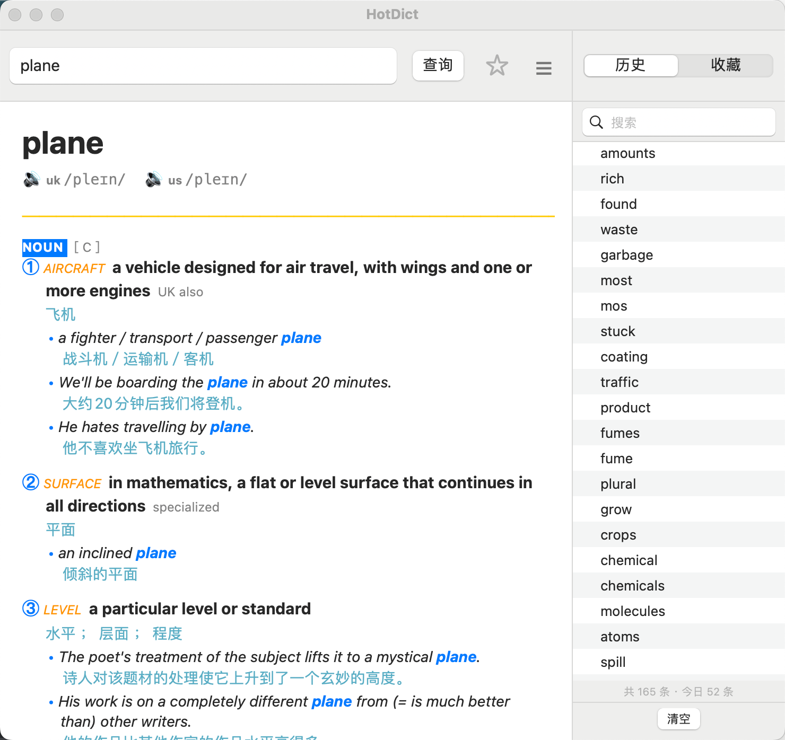

# HotDict

macOS 菜单栏词典，查询剑桥词典英汉繁体释义。原生 AppKit UI，无 Electron / WebView。



---

## 功能

- **划词查询** — 选中任意 App 中的单词，按全局快捷键自动查询
- **手动查询** — 主界面搜索框输入单词后回车
- **真人发音** — 点击 🔊 播放英式 / 美式发音
- **历史 & 收藏** — 自动记录历史，收藏单词支持导出 Excel
- **中文释义** — 英文定义 + 繁体中文翻译 + 斜体例句
- **离线缓存** — 查过的词本地缓存 7 天

---

## 安装

### 环境要求

- macOS 12+
- Python 3.9+（不支持 Anaconda / miniforge）

### 安装依赖

```bash
pip install pyobjc-core pyobjc-framework-Cocoa pyobjc-framework-Quartz \
            requests beautifulsoup4 lxml openpyxl py2app
```

### 构建

```bash
# 正式打包（可分发）
bash build.sh

# 开发模式（秒级构建，仅本机）
bash build.sh --dev
```

---

## 首次使用

### 1. 启动

将 `dist/HotDict.app` 拖入「应用程序」文件夹，双击启动，菜单栏出现 **C** 图标。

- **左键点击** C 图标 — 呼出主界面
- **右键点击** C 图标 — 偏好设置 / 退出

### 2. 授权（必须完成，否则快捷键无效）

全局快捷键依赖两项系统权限，**缺一不可**：

| # | 权限 | 设置方式 |
|---|------|---------|
| ① | **辅助功能** | 启动时系统自动弹窗 → 点击「打开系统设置」→ 勾选 HotDict |
| ② | **输入监控** | 系统设置 → 隐私与安全性 → 输入监控 → 手动将 HotDict 开关打开 |

两项均开启后**重启 App**，快捷键即可生效。

### 3. 快捷键

| 快捷键 | 功能 |
|--------|------|
| `⌘⌥C` | 划词查询（选中文字后按） |
| `⌘⌥X` | 呼出 / 隐藏主界面 |

> 两个快捷键均可在偏好设置中自定义。

---

## 分发给其他 Mac

### 绕过 Gatekeeper

由于 App 未经 Apple 公证，首次打开会被系统拦截。解决方式二选一：

**方式一：右键打开**
1. 右键单击 HotDict.app → 选择「打开」
2. 弹窗中点击「打开」确认
3. 此后可正常双击启动

**方式二：终端解除隔离**
```bash
xattr -cr /path/to/HotDict.app
```

### 权限设置

同上「授权」步骤，辅助功能 + 输入监控**两项均需手动开启**。

---

## 偏好设置

右键菜单栏 C 图标 → 偏好设置

| 设置项 | 说明 |
|--------|------|
| 划词查询快捷键 | 自定义触发键，支持冲突检测 |
| 呼出主界面快捷键 | 自定义触发键，支持冲突检测 |
| 查询接口地址 | 自定义词典 URL，留空恢复默认 |
| 侧边栏默认状态 | 启动时是否自动展开历史 / 收藏 |

---

## 数据存储

所有数据存储在 `~/.cambridge_tool/`：

| 文件 | 内容 |
|------|------|
| `history.json` | 查询历史，最多 200 条 |
| `favorites.json` | 收藏单词及完整词条数据 |
| `cache.json` | 词条缓存，7 天有效期 |
| `settings.json` | 偏好设置 |

---

## License

MIT
